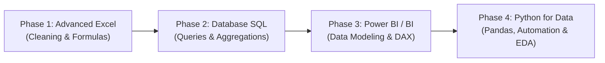

Every modern business—from small retail chains and hospital networks to tech startups and financial institutions—generates massive amounts of customer and sales data every day. Companies are desperately searching for professionals who can transform raw spreadsheet rows into **actionable executive revenue decisions**.

The best part? **You do not need a 4-year B.Tech in Computer Science or advanced calculus to become a Data Analyst in 2026.** Students from B.Com, B.A., B.Sc, BCA, and non-tech working backgrounds consistently transition into high-paying analytics careers within 6 to 9 months of structured daily practice.

Here is the exact step-by-step roadmap developed by **Er. Sumit Kumar** and taught inside our signature 12-Month Data Analysis Cohort at MSK Institute.

---

## The 4-Phase Tech Stack Roadmap



---

### Phase 1: Advanced Excel & Business Analytics (Weeks 1–4)

Never underestimate Microsoft Excel. Over 70% of business reporting still happens in spreadsheets:

- **Must-Master Formulas:** `XLOOKUP`, `INDEX/MATCH`, `SUMIFS`, `COUNTIFS`, `IFERROR`, `UNIQUE`, `FILTER`.
- **Data Hygiene:** Text-to-Columns, removing duplicate entries, trimming whitespace, and handling missing null records.
- **Pivot Tables & Slicers:** Grouping dates into Quarters/Fiscal Years, calculating Year-over-Year (YoY) percentage changes, and building interactive summary boards.
- **Goal:** Build an automated monthly revenue calculator that updates with 1-click refresh.

---

### Phase 2: Relational Databases & SQL (Weeks 5–10)

SQL is the single most tested skill in every data analyst interview. If you know SQL, you will easily clear technical screening rounds.

```sql
-- Sample Interview Query: Find top 3 highest spending customers by month
WITH MonthlySpend AS (
    SELECT 
        customer_id,
        DATE_TRUNC('month', order_date) AS order_month,
        SUM(order_amount) AS total_spent,
        DENSE_RANK() OVER (
            PARTITION BY DATE_TRUNC('month', order_date) 
            ORDER BY SUM(order_amount) DESC
        ) AS rank_in_month
    FROM orders
    WHERE order_status = 'Delivered'
    GROUP BY customer_id, DATE_TRUNC('month', order_date)
)
SELECT * FROM MonthlySpend WHERE rank_in_month <= 3;
```

#### Core SQL Topics to Target:
1. **Filtering & Aggregation:** `SELECT`, `WHERE`, `GROUP BY`, `HAVING`, `ORDER BY`.
2. **Joins:** `INNER JOIN`, `LEFT JOIN`, `RIGHT JOIN`, `FULL OUTER JOIN`, and resolving many-to-many relationships.
3. **Subqueries & Common Table Expressions (CTEs):** Writing readable, reusable query blocks using `WITH`.
4. **Window Functions:** `ROW_NUMBER()`, `RANK()`, `DENSE_RANK()`, `LEAD()`, `LAG()`.

---

### Phase 3: Business Intelligence with Power BI & DAX (Weeks 11–16)

Executives don't look at SQL terminal outputs; they inspect dynamic, high-impact visual dashboards. Power BI is currently the most demanded BI tool across Indian and global enterprises.

- **Power Query:** Extracting, Transforming, and Loading (ETL) data from CSVs, SQL databases, and web APIs.
- **Data Modeling:** Creating clean **Star Schema** models with one-to-many relationships between Fact tables and Dimension tables.
- **DAX (Data Analysis Expressions):** Writing calculated business metrics such as:
  ```dax
  YoY Sales Growth % = 
  DIVIDE(
      [Total Revenue] - [Previous Year Revenue],
      [Previous Year Revenue],
      0
  )
  ```
- **Dashboard Storytelling:** Designing executive dashboards with custom KPI cards, trend sparklines, and drill-through drill-downs.

---

### Phase 4: Python for Automation & Exploratory Data Analysis (Weeks 17–24)

When datasets exceed Excel's 1-million-row limit or when you need automated daily report generation, Python is your superpower:

- **Pandas:** Loading datasets (`pd.read_csv`), filtering columns, groupby aggregations, and merging disparate data frames.
- **NumPy:** Vectorized numerical operations and multi-dimensional matrix math.
- **Visual Analytics:** Plotting statistical correlations using Matplotlib and Seaborn heatmaps.
- **Automation Scripts:** Writing automated scripts that fetch database rows, clean inconsistencies, generate a PDF report, and send it via email.

---

## 3 Portfolio Projects That Guarantee Recruiter Interviews

Having a GitHub and Power BI NovyPro portfolio with real-world case studies beats any resume credential:

1. **E-Commerce Customer Churn Analysis:**
   - Analyze 50,000 order transactions to identify which customer cohorts stop ordering after 90 days.
   - Built with: SQL + Power BI + Python.
2. **Financial Bank Loan Default Prediction Dashboard:**
   - Visual dashboard highlighting non-performing asset (NPA) risks based on credit score, annual income, and debt-to-income ratio.
   - Built with: Excel + Power BI + DAX.
3. **Retail Store Supply Chain & Inventory Optimization:**
   - Track stock-out rates, supplier lead times, and warehouse turnover rates across 15 store branches.

---

## Data Analyst Salary Expectations in India (2026)

| Experience Level | Annual CTC Range (INR) | Primary Job Roles |
| :--- | :--- | :--- |
| **Fresher / Entry-Level** | **₹4.5 LPA – ₹7.5 LPA** | Junior Data Analyst, MIS Executive, BI Trainee |
| **Mid-Level (2–4 Years)** | **₹8.5 LPA – ₹15.0 LPA** | Data Analyst, BI Developer, Product Analyst |
| **Senior / Lead (5+ Years)** | **₹18.0 LPA – ₹32.0+ LPA** | Analytics Manager, Lead BI Consultant, Data Strategist |

---

## Summary & Your Next Step

Transitioning into Data Analytics does not require genius math abilities; it requires consistent, hands-on practice on real business datasets.

At **MSK Institute**, our students in the **[12-Month Data Analysis Mastery Combo Program](/courses/data-analysis-mastery-combo-course--12-months)** work on 10+ live enterprise case studies, master Excel, SQL, Power BI, and Python, and receive 1-on-1 resume reviews and interview preparation. 

Join our next interactive online live cohort or visit our computer labs in Shikohabad to kickstart your tech journey today!
