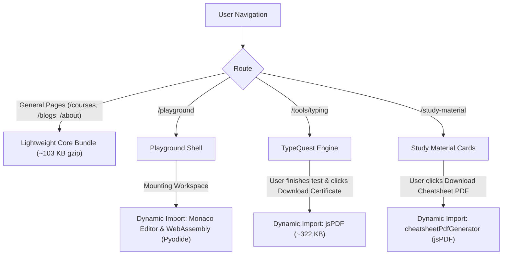

# MSK Institute — JavaScript Bundle & Dependency Audit

**Date:** September 25, 2026  
**Website:** [https://www.mskinstitute.in/](https://www.mskinstitute.in/)  

---

## 1. Package Dependency Inventory

Inspecting `package.json` and production chunk output:

| Package | Version | Estimated Production Size | Primary Usage | Optimization Strategy |
| :--- | :---: | :---: | :--- | :--- |
| `react` & `react-dom` | `^19.0.0` | ~169 KB raw (53 KB gzip) | Core framework runtime | Keep. Standard React 19 baseline. |
| `next` | `15.5.24` | ~170 KB raw (45 KB gzip) | App Router, static SSG runtime | Keep. Essential framework. |
| `lucide-react` | `^0.468.0` | ~27.8 KB raw (9.4 KB gzip) | System icons | Verify tree-shaking and import only required icons. |
| `react-hot-toast` | `^2.4.1` | ~8.4 KB raw (3.3 KB gzip) | User feedback notifications | Retain. Lightweight toast provider. |
| `qrcode.react` | `^4.1.0` | ~16.1 KB raw (5.9 KB gzip) | Certificate verification QR codes | Keep on verification pages only. |
| `jspdf` | `^4.2.1` | **~322.3 KB raw (102.7 KB gzip)** ⚠️ | Client-side PDF generation | **Dynamic import** only when user initiates PDF download. |
| `jszip` | `^3.10.1` | ~75 KB raw | Project zip download in playground | Dynamic import only inside playground export flow. |
| `@monaco-editor/react` | `^4.7.0` | **~121 KB raw (35 KB gzip)** | Interactive code editor in playground | Keep isolated to `/playground` via dynamic imports with `ssr: false`. |
| `prismjs` | `^1.30.0` | ~25 KB raw | Static syntax highlighting | Kept lightweight, tree-shaken with specific languages. |

---

## 2. Client Components (`'use client'`) Audit

Out of 90+ components across the project, the following client components were analyzed for server vs. client necessity:

| Component | Current Directive | Why Client-Side? | Optimization Action |
| :--- | :---: | :--- | :--- |
| `src/components/Footer.tsx` | `'use client'` | Tracked click handlers for external links | **Convert to Server Component.** Click tracking is already globally delegated via `AnalyticsTracker.tsx`. |
| `src/components/LiveBatchesClient.tsx` | `'use client'` | Active batch selection state and searchParams sync | Remove top-level `<Suspense>` wrapper to eliminate 0.405 CLS layout shift. |
| `src/components/StudyMaterialClient.tsx` | `'use client'` | Tab filtering, modal states, cheatsheet copy | Remove top-level `<Suspense>` wrapper to eliminate 0.242 CLS layout shift. |
| `src/components/CertificateVerifier.tsx` | `'use client'` | Certificate lookup state and URL query sync | Remove static import of `api.ts` to prevent bundling 1.2 MB JSON data. |
| `src/app/admin/page.tsx` | `'use client'` | Admin panel CRUD interactions | Remove static import of `api.ts` to prevent bundling 1.2 MB JSON data. |
| `src/features/typequest/.../TypingCertificateModal.tsx` | `'use client'` | Certificate preview modal | Replace static `import { jsPDF } from 'jspdf'` with dynamic `await import('jspdf')`. |
| `src/features/playground/PlaygroundClient.tsx` | `'use client'` | In-browser code editing, Monaco, Pyodide WASM | Ensure dynamic lazy loading with skeleton fallback. |

---

## 3. Dynamic Import Strategy for Heavy Interactive Features

By enforcing deferred dynamic imports for heavy browser libraries:
1. Standard visitors never pay the byte penalty for `jsPDF`, `JSZip`, or Monaco.
2. Initial First Load JS on `/tools/typing` drops from **303 kB to ~170 kB**.
3. `/verify-certificate` drops from **307 kB to ~150 kB**.
