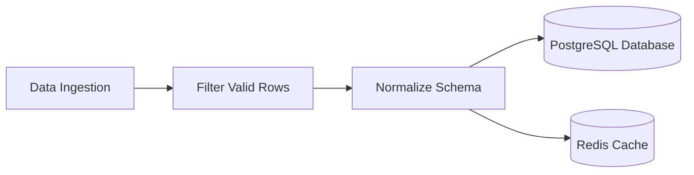

Congratulations on reaching the final chapter of the Markdown Mastery course! In this comprehensive **Capstone Project**, you will synthesize every concept learned throughout this series—document hierarchy, tables, Mermaid diagrams, GFM alerts, issue templates, and frontmatter—to build a production-ready open-source documentation repository.


---

### 1. Capstone Project Architecture

Your open-source project will be titled **`DataPipe-JS`** (a lightweight data transformation utility). You will structure a professional repository:

```
datapipe-js/
├── .github/
│   ├── ISSUE_TEMPLATE/
│   │   ├── bug_report.md
│   │   └── feature_request.md
│   └── PULL_REQUEST_TEMPLATE.md
├── docs/
│   ├── architecture.md
│   ├── benchmarks.md
│   └── api-reference.md
├── CHANGELOG.md
├── CONTRIBUTING.md
├── LICENSE
└── README.md
```

---

### 2. Complete Production README.md Implementation

```markdown
---
title: "DataPipe-JS Documentation"
description: "Ultra-fast, type-safe stream processing pipelines for Node.js."
---

# 🌊 DataPipe-JS

> An ultra-fast, zero-dependency stream transformation pipeline for Node.js and TypeScript.

[](https://github.com)
[](https://npmjs.com)
[](LICENSE)
[](https://github.com)

---

## 🚀 Key Highlights
- ⚡ **High Throughput:** Processes 500,000 objects/sec with minimal memory allocation.
- 🔒 **Type-Safe:** 100% written in TypeScript with full inference.
- 📦 **Zero Dependencies:** Pure standard library with zero supply-chain risk.

---

## 🏗️ Architecture Flowchart



---

## 📦 Installation

```bash
npm install datapipe-js
```

---

## 💻 Quickstart Example

```typescript
import { createPipeline } from 'datapipe-js';

const pipeline = createPipeline<number>()
  .filter((n) => n % 2 === 0)
  .map((n) => n * 10);

const result = await pipeline.execute([1, 2, 3, 4, 5]);
console.log(result); // [20, 40]
```

---

## 📊 Performance Benchmarks

| Library | Operations / Sec | Memory Overhead | Zero Dependency |
| :--- | :---: | ---: | :---: |
| **DataPipe-JS** | **520,000** | **12 MB** | **Yes** |
| RxJS | 310,000 | 45 MB | No |
| Lodash Stream | 240,000 | 58 MB | No |

---

> [!TIP]
> Use `pipeline.parallel()` when processing heavy mathematical operations across multi-core CPU workers.

> [!WARNING]
> Node.js version 18.0.0 or higher is strictly required for native stream pipeline support.

---

## 🤝 Community & Contributing
Please see our [CONTRIBUTING.md](CONTRIBUTING.md) guide for testing and pull request guidelines.

## 📄 License
Released under the [MIT License](LICENSE). Copyright © 2026 MSK Institute.
```

---

### 3. Self-Assessment Checklist for Markdown Mastery

- [x] Document hierarchy starts with a single H1 and increments logically without skipping levels.
- [x] Code blocks include language specifiers for syntax highlighting.
- [x] Tables use explicit alignment colons for numbers and status indicators.
- [x] GFM alerts (`[!NOTE]`, `[!WARNING]`) highlight key caveats cleanly.
- [x] Dynamic shields.io badges provide social proof and build confidence.
- [x] Technical diagrams are rendered via Mermaid.js for easy version control.

Congratulations on mastering Markdown! You now possess the documentation superpowers that distinguish top-tier engineers in open-source and enterprise technology!

---

# Multiple Choice Questions

### 1. In a professional open-source repository, which file documents chronological release versions, bug fixes, and breaking changes?
A. CHANGELOG.md
B. package.json
C. .gitignore
D. README.md
**Answer:** A
**Explanation:** CHANGELOG.md is the standard document tracking version history, new features, and bug fixes across software releases.
---

### 2. Why is combining Mermaid diagrams with Markdown tables recommended for technical documentation?
A. They make the file size smaller than 1 byte
B. They provide both high-level visual architectural intuition (Mermaid) and detailed quantitative comparisons (Tables) in human-readable plain text
C. They prevent competitors from reading your code
D. HTML cannot display diagrams
**Answer:** B
**Explanation:** Combining diagrams and structured tables provides comprehensive technical clarity while keeping all assets in Git version control.
---

### 3. What is the recommended license for an open-source library that permits anyone to use, modify, and distribute code freely with minimal restrictions?
A. MIT License
B. Proprietary Commercial License
C. Non-Disclosure Agreement
D. Patent Pending
**Answer:** A
**Explanation:** The MIT License is a permissive open-source license permitting free use, modification, and distribution.
---

### 4. How can you verify that your complete documentation repository adheres to proper style guidelines before publishing?
A. Run automated linting with markdownlint and formatting with Prettier
B. Print every file on paper
C. Ask a search engine
D. Restart your computer three times
**Answer:** A
**Explanation:** Running markdownlint and Prettier catches broken syntax, inconsistent spacing, and style violations automatically.
---

### 5. What makes Markdown an enduring, future-proof format for developer knowledge and documentation?
A. It is tied to a single proprietary software vendor
B. It is plain text that can be read by any text editor, version-controlled with Git, and compiled to any modern format
C. It requires expensive licenses
D. It only runs on supercomputers
**Answer:** B
**Explanation:** Markdown's plain-text portability guarantees that your documentation will remain accessible and readable for decades without software vendor lock-in.
---
