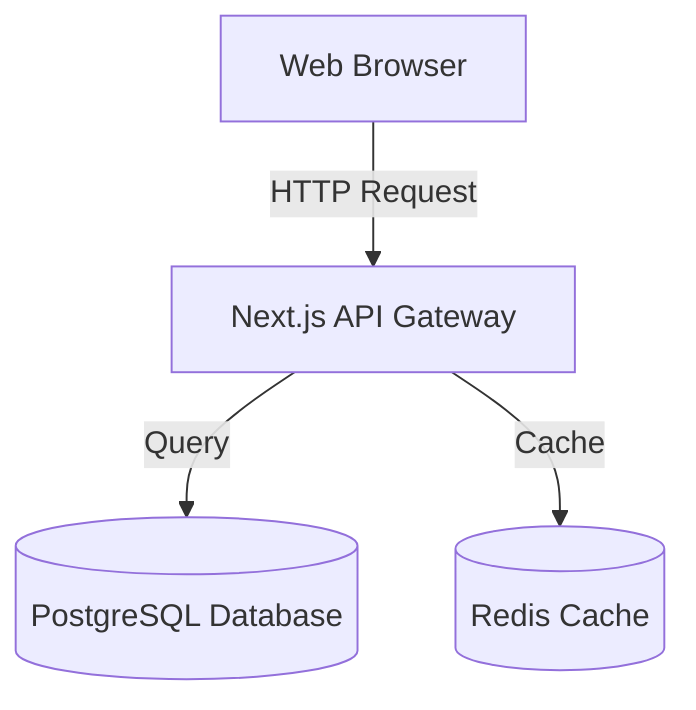
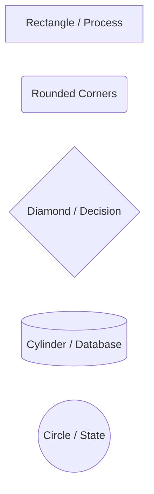
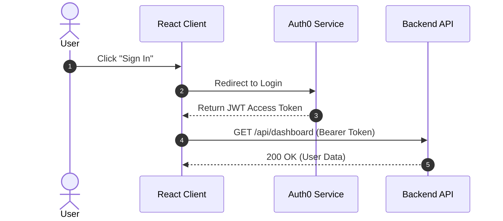
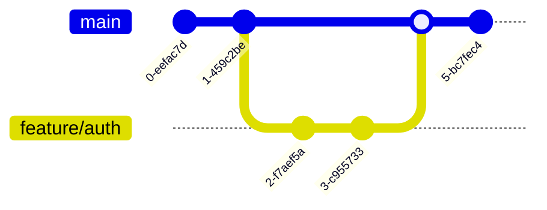

Creating architectural diagrams, database entity-relationship models, and system sequence flows used to require external drawing tools like Visio or Figma. If the system architecture changed, the designer had to redraw and re-export the image.

**Mermaid.js** solves this forever by allowing developers to write **diagrams as plain text code** directly inside Markdown!


---

### 1. The Mermaid Fenced Code Block

To create a Mermaid diagram, open a standard fenced code block and specify `mermaid` as the language identifier:

```markdown

```

When parsed by GitHub, GitLab, Notion, or Obsidian, this plain text compiles into an interactive, vector SVG diagram!

---

### 2. Flowchart Directions & Node Shapes

#### Directions:
- `TD` or `TB`: Top-to-Bottom
- `LR`: Left-to-Right
- `BT`: Bottom-to-Top
- `RL`: Right-to-Left

#### Node Shapes:


---

### 3. Sequence Diagrams (API & Microservice Flows)

Sequence diagrams illustrate how processes communicate with one another over time:

```markdown

```

---

### 4. Git Graphs & State Diagrams

You can even illustrate git branching strategies directly in your documentation:

```markdown

```

---

# Multiple Choice Questions

### 1. Which language identifier is placed after opening triple backticks to render Mermaid diagrams in Markdown?
A. diagram
B. mermaid
C. flowchart
D. graph
**Answer:** B
**Explanation:** Specifying ```mermaid tells Markdown parsers that the code block contains Mermaid diagram definitions.
---

### 2. In a Mermaid flowchart, what direction is specified by 'graph LR'?
A. Low Resolution
B. Left-to-Right layout
C. Long Range
D. Loop Recursion
**Answer:** B
**Explanation:** In Mermaid syntax, 'LR' specifies a horizontal flow moving from Left to Right.
---

### 3. Which node shape syntax in Mermaid represents a database cylinder?
A. [Rectangle]
B. {Diamond}
C. [(Cylinder)]
D. ((Circle))
**Answer:** C
**Explanation:** Surrounding text with square brackets and parentheses [(Database)] renders a database cylinder icon in Mermaid.
---

### 4. What is the primary advantage of writing diagrams in Mermaid rather than uploading static PNG images?
A. Mermaid diagrams can be edited, version-controlled with Git, and updated as plain text without redrawing
B. Mermaid uses fewer colors
C. Mermaid diagrams only work on Windows
D. Mermaid diagrams cannot be copied
**Answer:** A
**Explanation:** Plain-text diagrams allow version tracking in Git, pull request code reviews, and instant maintenance when architectures change.
---

### 5. Which type of Mermaid diagram is best suited for documenting API authentication request/response interactions over time?
A. Pie Chart
B. Sequence Diagram (sequenceDiagram)
C. Gantt Chart
D. Mindmap
**Answer:** B
**Explanation:** Sequence diagrams illustrate the step-by-step chronological message exchange between actors and services.
---
